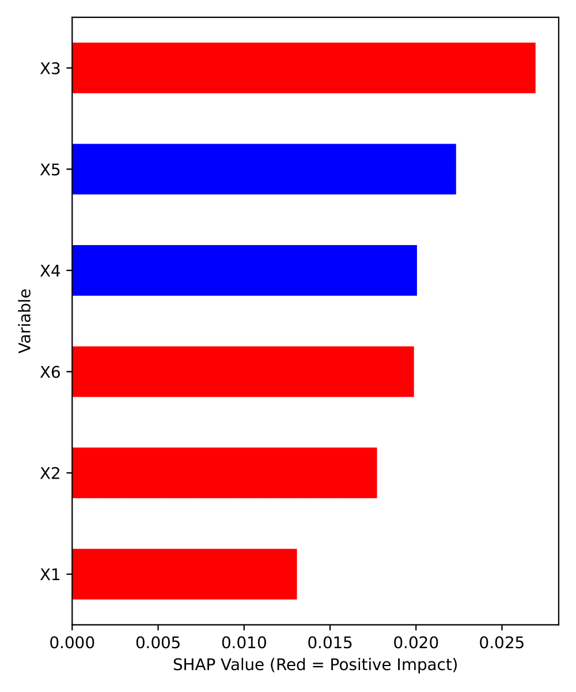

## Welcome to RISE!

Python package ``RISE`` for paper "RISE: Robust Individualized Decision Learning with Sensitive Variables", which has recently been accepted by **NeurIPS 2022** for publication [[paper]](https://openreview.net/forum?id=-IHPcl1ZhF5).

**TL;DR:** We introduce RISE, a robust individualized decision learning framework to improve the worst-case outcomes of individuals caused by sensitive variables that are unavailable at the time of decision.  

**Keywords:** causal inference, individualized treatment rules, sensitive variables, robustness.  


## To install package
```py
git clone https://github.com/ellenxtan/RISE.git
cd RISE
pip install .
```

### Dependencies

Tensorflow, Keras, sklearn, SHAP (SHapley Additive exPlanations), pandas, numpy, and all of their respective dependencies. 


## Examples to run RISE 

### With default parameters (no tuning)

```py
from rise import utils as utils
from rise import rise as r
import pandas as pd

train_df = pd.read_csv("data/cont_df_train.csv")
test_df = pd.read_csv("data/cont_df_test.csv")

Y_name = "Y"
A_name = "A"
X_names = ["X1","X2","X3","X4","X5","X6"]
S_names = ["S"]
is_rct = False
is_class = False
s_type = "cont"
qua_use = 0.25

out, out_mod = r.rise(train_df, test_df, Y_name, A_name, X_names, S_names, 
                      is_rct, is_class, s_type, qua_use, 
                      is_tune=False, param_grid=None, is_plot=True, seed=12345)
```

### Hyperparameter tuning

```py
from rise import utils as utils
from rise import rise as r
import pandas as pd

train_df = pd.read_csv("data/cont_df_train.csv")
test_df = pd.read_csv("data/cont_df_test.csv")

Y_name = "Y"
A_name = "A"
X_names = ["X1","X2","X3","X4","X5","X6"]
S_names = ["S"]
is_rct = False
is_class = False
s_type = "cont"
qua_use = 0.25
is_tune = True
param_grid = dict(layers=[2,3], 
                  nodes=[256,512,1024], 
                  dropouts=[0.2,0.4], 
                  acts=["sigmoid","relu"], 
                  opts=["adam","nadam"], 
                  bsizes=[32,64,128], 
                  n_epochs=[50,100,200]
                  )

out, out_mod = r.rise(train_df, test_df, Y_name, A_name, X_names, S_names, 
                      is_rct, is_class, s_type, qua_use, 
                      is_tune, param_grid, is_plot=True, seed=12345)
```

### Output

You may obtain the predicted decision rule, vulnerable index, and evaluation metrics including objective and value functions by calling:

```
out.A_pred
out.is_vul
out.obj_all
out.val_all
out.obj_vul
out.val_vul
out.model
```

### SHAP plot for interpretation

Visualizations about feature importance in the final classification models to
help interpret important covariates in making the decisions.

```py
from rise import plots as p

p.plot_shap(out_mod, save_path="./")
```




## Paper code

Code is under folder `code_for_paper`. Run `script.py` to get started. 

- `script.py`: starter code
- `loop.py`: wrapper function for data analysis
- `imports.py`: imported libraries
- `myfuns.py`: utility functions
- `dat.py`: functions for data


## Cite

An early [version](https://responsibledecisionmaking.github.io/assets/pdf/papers/08.pdf) was presented at the ICML 2022 Workshop on Responsible Decision Making in Dynamic Environments. 

If you find this repository useful, please cite:

```
@inproceedings{
  tan2022rise,
  title={{RISE}: Robust Individualized Decision Learning with Sensitive Variables},
  author={Xiaoqing Tan and Zhengling Qi and Christopher Warren Seymour and Lu Tang},
  booktitle={Advances in Neural Information Processing Systems},
  editor={Alice H. Oh and Alekh Agarwal and Danielle Belgrave and Kyunghyun Cho},
  year={2022},
  url={https://openreview.net/forum?id=-IHPcl1ZhF5}
}
```
